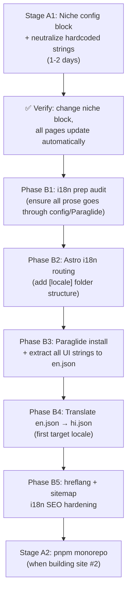

# Monorepo Readiness + i18n — Master Plan

## Background

The current `multitools-astssl-1` project is a **single Astro site** that currently serves as the demo/base template.
The long-term vision is a **monorepo of niche sites** (dev-tools, finance, PDF, QR, converters, etc.) all spawned from this single codebase.
Additionally, **i18n** (multi-language) support needs to be planned before any of this gets baked deeper.

This plan has **two independent axes**:
- **Axis A** — Monorepo Architecture (making the codebase niche-agnostic)
- **Axis B** — i18n Architecture (making the codebase language-agnostic)

---

## Problem Diagnosis

### What's hardcoded right now (audit results)

These are the actual strings found in the live codebase that assume this is a "calculators & converters" site:

| Location | Hardcoded String | Risk |
|---|---|---|
| `src/config.ts:322` | `defaultKeywords: ["tools", "calculators", "utilities"...]` | Goes into every page's meta keywords |
| `src/config.ts:354-358` | `titleDescriptors` with "Free Calculator / Converter" per category | Every tool page title suffix |
| `src/pages/index.astro:75` | `"Free Online Tools and Calculators"` | Homepage `<title>` |
| `src/pages/categories/index.astro:25` | `"All Tool Categories - Free Calculators & Converters"` | SEO title |
| `src/pages/categories/index.astro:20` | `"find the perfect calculator or utility"` | Meta description |
| `src/pages/categories/[category].astro:31` | `"tools and calculators"` | Dynamic category description |
| `src/pages/about.astro:31` | `"financial calculators"`, `"daily utility tools"` | About page body prose |
| `src/pages/about.astro:41` | `"deploy new calculators"` | About page body prose |
| `src/pages/disclaimer.astro:14,18,29,35` | Full financial disclaimer language | Legal page — finance-specific |
| `src/pages/terms.astro:32` | `"financial decisions"`, `"financial advisor"` | Terms — finance-specific |
| `src/pages/privacy.astro:34` | `"financial or personal data"` | Privacy — finance-specific |
| `src/pages/404.astro:12` | `"browse our free calculators and tools"` | 404 description |
| `src/components/blog/sidebar/BlogSidebar.astro:18` | `"free financial calculators and converters"` | Blog sidebar CTA |
| `src/components/common/seo/ToolPageSchemas.astro:70,92` | `"calculate or convert"`, appends "Calculator Guide" suffix | Schema.org structured data |
| `src/components/get-app/*` | SIP Calculator, EMI Calculator, GST Tools, "financial, mathematical" | Mobile app showcase page |
| `src/components/common/dialogs/SearchDialogContent.svelte:65` | `"Search tools, calculators, articles..."` | Search placeholder text |

### Two distinct problem types

**Type 1 — Config-driven strings** (live in `config.ts` or driven from it):
These are easy to fix — extend `siteConfig` with a `niche` block and route through it.

**Type 2 — Hardcoded prose** (in `.astro` files directly):
These need `config.ts` keys OR need to become template-driven (especially legal pages).

---

## Axis A: Monorepo Architecture

### The Strategy: "Config-first monorepo" → then folder monorepo

This is a **two-stage** approach that avoids premature infrastructure complexity:

#### Stage A1 — Make the single site niche-agnostic (do NOW)
Before creating multiple repos/workspaces, the current site must be fully configurable so that **changing `siteConfig` alone produces a different niche site** with zero code changes.

#### Stage A2 — Extract into pnpm monorepo (do LATER, when 2nd site is ready)
Once you're actually building site #2, extract shared packages and move to pnpm workspaces.

---

### Stage A1: Niche-Agnostic `config.ts` (Immediate Work)

#### Add a `niche` block to `siteConfig`

```typescript
// NEW — add to SiteConfig interface
niche: {
  /** Human-readable category of tools this site focuses on */
  label: string;           // "Calculators & Converters" | "PDF Tools" | "Dev Tools"
  /** Short plural noun describing the tools */
  toolNoun: string;        // "tools" | "calculators" | "converters" | "utilities"
  /** Short noun for a single tool */
  toolNounSingular: string;// "tool" | "calculator" | "converter"
  /** Used in legal/disclaimer pages to describe what the tools do */
  toolActionVerb: string;  // "calculate" | "convert" | "generate" | "process"
  /** Whether this niche needs a financial disclaimer */
  hasFinancialDisclaimer: boolean;
  /** Generic SEO descriptor for the category listing page title */
  categoryPageDescriptor: string; // "Free Calculators & Converters" | "Free PDF Tools"
  /** Default meta description keyword phrase */
  defaultDescKeyword: string;     // "calculator or utility" | "PDF tool" | "developer tool"
  /** Homepage title suffix after site name */
  homepageTitleSuffix: string;    // "Free Online Tools and Calculators" | "Free PDF Tools Online"
  /** Search placeholder text */
  searchPlaceholder: string;      // "Search tools, calculators, articles..."
  /** Blog sidebar CTA text */
  blogSidebarCta: string;         // "Try our free financial calculators and converters."
};
```

Then for the **current finance/calculator site**, values would be:
```typescript
niche: {
  label: "Calculators & Converters",
  toolNoun: "tools",
  toolNounSingular: "tool",
  toolActionVerb: "calculate",
  hasFinancialDisclaimer: true,
  categoryPageDescriptor: "Free Calculators & Converters",
  defaultDescKeyword: "calculator or utility",
  homepageTitleSuffix: "Free Online Tools and Calculators",
  searchPlaceholder: "Search tools, calculators, articles...",
  blogSidebarCta: "Try our free financial calculators and converters.",
},
```

For a **future PDF site**, values would be:
```typescript
niche: {
  label: "PDF Tools",
  toolNoun: "tools",
  toolNounSingular: "tool",
  toolActionVerb: "process",
  hasFinancialDisclaimer: false,
  categoryPageDescriptor: "Free PDF Tools Online",
  defaultDescKeyword: "PDF tool or utility",
  homepageTitleSuffix: "Free Online PDF Tools",
  searchPlaceholder: "Search PDF tools, guides...",
  blogSidebarCta: "Try our free PDF editing and conversion tools.",
},
```

#### Pages/components that consume `siteConfig.niche.*`

| File | Replace with |
|---|---|
| `pages/index.astro` | `siteConfig.niche.homepageTitleSuffix` |
| `pages/categories/index.astro` | `siteConfig.niche.categoryPageDescriptor` |
| `pages/categories/[category].astro` | `siteConfig.niche.defaultDescKeyword` |
| `pages/about.astro` | `siteConfig.niche.label`, `siteConfig.niche.toolNoun` |
| `pages/404.astro` | `siteConfig.niche.toolNoun` |
| `pages/disclaimer.astro` | `siteConfig.niche.hasFinancialDisclaimer` (conditional render) |
| `pages/terms.astro` | `siteConfig.niche.hasFinancialDisclaimer` (conditional render) |
| `pages/privacy.astro` | `siteConfig.niche.toolActionVerb` |
| `components/blog/sidebar/BlogSidebar.astro` | `siteConfig.niche.blogSidebarCta` |
| `components/common/dialogs/SearchDialogContent.svelte` | `siteConfig.niche.searchPlaceholder` |
| `components/common/seo/ToolPageSchemas.astro` | `siteConfig.niche.toolActionVerb` |
| `config.ts` → `seo.defaultKeywords` | Include `siteConfig.niche.toolNoun` dynamically |

#### The `disclaimer.astro` special case
This page currently has hard financial legalese baked in. Two options:
- **Option 1 (recommended):** Use `hasFinancialDisclaimer` flag → show **generic tool disclaimer** by default, show **financial addendum** block only when `true`.
- **Option 2:** Store disclaimer content blocks in `config.ts` as template strings.

Option 1 is cleaner — keep the legal prose in the `.astro` file as conditional `{#if}` blocks.

#### The `get-app/` section
The `/get-app` page (AppTools.astro, AppTestimonials.astro, AppHero.astro) has **SIP, EMI, GST** tools hardcoded. These are **demo/showcase content** and should either:
- Be driven from `siteConfig.features.getApp.featuredTools: string[]` (list of tool slugs to showcase)
- Or accepted as-is since every niche site will have its own `get-app` showcase content customized per niche

**Recommendation:** Leave `get-app/` components as niche-specific per site — they're marketing pages, not data-driven.

---

### Stage A2: pnpm Workspace Monorepo (When Building Site #2)

```
my-tools-monorepo/
├── apps/
│   ├── multitools/          ← current site (finance/calc)
│   ├── devtools/            ← future: devtools.app
│   ├── pdftools/            ← future: pdftools.app
│   └── qrtools/             ← future: qrcode-site.app
├── packages/
│   ├── ui/                  ← shared Astro + Svelte components
│   │   ├── src/components/common/
│   │   ├── src/layouts/
│   │   └── package.json
│   ├── config-types/        ← shared TypeScript interfaces (SiteConfig shape)
│   │   └── src/types.ts
│   ├── utils/               ← shared utilities (seo.ts, slug.ts, w3c-date.ts, etc.)
│   │   └── src/
│   └── content-types/       ← shared content.config.ts schema types
│       └── src/
├── pnpm-workspace.yaml
├── turbo.json               ← optional but recommended for build caching
└── package.json
```

#### What gets shared vs. what stays per-site

| Layer | Shared Package | Per-Site |
|---|---|---|
| TypeScript config interface shape | `@tools/config-types` | `src/config.ts` (the actual VALUES) |
| Layout components (BaseLayout, ToolLayout, BlogLayout) | `@tools/ui` | Overrides per niche |
| Common UI (Breadcrumb, Button, SearchDialog, etc.) | `@tools/ui` | — |
| Utility functions (seo.ts, slug.ts, og.ts, etc.) | `@tools/utils` | — |
| Content collection schemas | `@tools/content-types` | — |
| Niche-specific pages (about, disclaimer, get-app) | — | Per-site `src/pages/` |
| Tool widgets (Svelte) | — | Per-site `src/widgets/` |
| Actual tool content (`.md` files) | — | Per-site `src/content/tools/` |
| `config.ts` (the actual values) | — | Per-site root `src/config.ts` |
| SEO/Analytics keys | — | Per-site `.env` |
| CSS theme | `@tools/ui/styles/themes/` | Per-site can override |

#### `pnpm-workspace.yaml`
```yaml
packages:
  - 'apps/*'
  - 'packages/*'
```

#### Per-site `package.json` dependencies
```json
{
  "dependencies": {
    "@tools/ui": "workspace:*",
    "@tools/utils": "workspace:*",
    "@tools/config-types": "workspace:*"
  }
}
```

#### Build commands
```bash
# Build only one site
pnpm build --filter multitools

# Build all sites (with Turborepo caching — only rebuilds changed)
pnpm turbo build

# Dev one site
pnpm dev --filter devtools
```

> [!IMPORTANT]
> **Don't rush Stage A2.** The monorepo structure only pays off when you have 2+ sites. Premature extraction creates overhead. Focus on Stage A1 first — making the single site fully config-driven is the prerequisite anyway.

---

## Axis B: i18n Architecture

### The Strategy: Astro Native Routing + Paraglide for UI Strings

**Two separate concerns:**

| Concern | Tool | Why |
|---|---|---|
| URL routing & page structure | **Astro built-in i18n** | Zero-dependency, built into Astro v4+ |
| UI string translations (labels, buttons, static text) | **Paraglide JS** | Type-safe, tree-shaken, compile-time optimized |
| Content translation (blog posts, tool descriptions) | **Content Collections (separate folders)** | One `.md` per locale |

---

### Phase B1: Preparation (Do BEFORE i18n work)

**Everything in Stage A1 is a prerequisite for i18n.**
If strings are hardcoded in `.astro` files, translating them requires touching every file.
If they're in `config.ts` or in Paraglide message files, translating is a single-file change.

So the order is:
```
Stage A1 (niche-agnostic config) → Phase B1 (i18n prep) → Phase B2 (i18n implementation)
```

### Phase B2: Astro i18n Routing Setup

#### `astro.config.mjs` changes
```js
export default defineConfig({
  i18n: {
    defaultLocale: 'en',
    locales: ['en', 'hi', 'es'],  // expand as needed
    routing: {
      prefixDefaultLocale: false,  // en stays at /tools, not /en/tools
    },
    fallback: {
      hi: 'en',   // Hindi falls back to English if page not translated
      es: 'en',
    },
  },
});
```

With `prefixDefaultLocale: false`:
- English: `multitools.app/tools/sip-calculator` ← no prefix (best for SEO)
- Hindi: `multitools.app/hi/tools/sip-calculator`
- Spanish: `multitools.app/es/tools/sip-calculator`

#### Page routing structure
```
src/pages/
├── tools/[tool].astro          ← English (default)
├── blog/index.astro            ← English (default)
├── [locale]/
│   ├── tools/[tool].astro      ← Hindi, Spanish
│   └── blog/index.astro        ← Hindi, Spanish
```

Or alternatively use the **dynamic `[locale]` catch-all** to avoid duplicating page files.

### Phase B3: Paraglide for UI Strings

#### Why Paraglide over alternatives

| Library | Bundle Size | Type-Safe | Astro Support | Tree-shaking |
|---|---|---|---|---|
| **Paraglide** | ~1KB | ✅ Full | ✅ Official integration | ✅ Per-component |
| i18next | ~30KB | Partial | Via wrapper | ❌ |
| astro-i18n | ~5KB | Partial | ✅ | Partial |
| Custom JSON | 0KB | ❌ | Manual | ❌ |

#### Setup
```bash
npx @inlang/paraglide-astro@latest init
```

#### Message file structure
```
src/
└── paraglide/
    └── messages/
        ├── en.json    ← source of truth
        ├── hi.json    ← Hindi translations
        └── es.json    ← Spanish translations
```

#### `en.json` — maps directly to what was in `.astro` files
```json
{
  "nav_home": "Home",
  "nav_categories": "Categories",
  "search_placeholder": "Search tools, calculators, articles...",
  "blog_sidebar_cta": "Try our free tools and calculators.",
  "tool_schema_action": "calculate or convert",
  "categories_page_title": "All Tool Categories - Free Calculators & Converters",
  "categories_page_desc": "Browse all our tool categories to find the perfect tool for your needs.",
  "homepage_title_suffix": "Free Online Tools and Calculators",
  "404_description": "Return home to browse our free tools.",
  "about_mission_snippet": "We built {siteName} because we were tired of bloated online tools...",
  "about_team_snippet": "We are a small team of independent engineers...",
  "disclaimer_generic": "The tools and information provided are for educational purposes only.",
  "disclaimer_financial_addendum": "Real-world financial outcomes are subject to variable terms..."
}
```

#### Usage in `.astro` components
```astro
---
import * as m from '../paraglide/messages';
---
<p>{m.blog_sidebar_cta()}</p>
<input placeholder={m.search_placeholder()} />
```

#### Usage in `.svelte` components
```svelte
<script>
  import * as m from '../paraglide/messages';
</script>
<input placeholder={m.search_placeholder()} />
```

### Phase B4: Content Translation

Tool and blog content lives in Content Collections. For i18n:

```
src/content/
├── tools/
│   └── sip-calculator/
│       ├── index.md        ← English (default)
│       ├── index.hi.md     ← Hindi
│       └── index.es.md     ← Spanish
├── blog/
│   ├── my-post/
│   │   ├── index.md        ← English
│   │   └── index.hi.md     ← Hindi
```

Or using separate collection per locale (scales better):
```
src/content/
├── tools/           ← en
├── tools-hi/        ← hi
└── tools-es/        ← es
```

**Recommendation:** Start with the **locale-suffix on files** approach (`index.hi.md`) — simpler to manage, easy to see what's translated at a glance.

### Phase B5: SEO for i18n

#### `hreflang` tags (critical for Google)
```astro
---
// In BaseLayout.astro
const locales = ['en', 'hi', 'es'];
const hreflangLinks = locales.map(locale => ({
  locale,
  url: getAbsoluteLocaleUrl(locale, Astro.url.pathname),
}));
---
<head>
  {hreflangLinks.map(({ locale, url }) => (
    <link rel="alternate" hreflang={locale} href={url} />
  ))}
  <link rel="alternate" hreflang="x-default" href={canonicalURL} />
</head>
```

#### Locale-specific `siteConfig` overrides
For locale-specific SEO (different site descriptions in Hindi), use:
```typescript
// config.ts
localeOverrides: {
  hi: {
    seo: {
      description: "Hindi description here...",
    }
  }
}
```

---

## Execution Order (Recommended)



---

## Open Questions

> [!IMPORTANT]
> **Q1: What is the first target locale for i18n?**
> Hindi (`hi`) seems natural given the INR/Indian finance context of the current demo. Confirm before implementing routing.

> [!IMPORTANT]
> **Q2: Should the English URL stay prefix-free?**
> Recommendation is `prefixDefaultLocale: false` so `multitools.app/tools/...` stays the same for English (zero SEO disruption). Hindi becomes `/hi/tools/...`. Confirm this is the desired URL structure.

> [!IMPORTANT]
> **Q3: Will all niche sites share one domain with subdomains, or separate domains?**
> - **Subdomains:** `finance.multitools.app`, `dev.multitools.app` — easiest to operate
> - **Separate domains:** `financetools.app`, `devutils.app` — stronger niche SEO signal
> - **Subdirectories:** `multitools.app/finance/`, `multitools.app/dev/` — worst for niche SEO
> This decision affects how Stage A2 is structured.

> [!NOTE]
> **Q4: The get-app showcase page**
> It has hardcoded SIP/EMI/GST tools. Should it be made data-driven (driven by config), or left as a per-site marketing page that each niche customizes manually? Leaving it manual is simpler.

---

## Summary: What to Build

### Stage A1 — Do First (Immediate)
1. Add `niche: { ... }` block to `SiteConfig` interface in `config.ts`
2. Populate the block for the current finance/calc site
3. Replace hardcoded strings in all pages with `siteConfig.niche.*` references
4. Add conditional `{hasFinancialDisclaimer}` blocks to `disclaimer.astro` and `terms.astro`
5. Verify by swapping the niche config values manually

### Phase B (i18n — When Ready)
6. Install Paraglide: `npx @inlang/paraglide-astro@latest init`
7. Extract ALL UI strings into `messages/en.json`
8. Configure `astro.config.mjs` i18n routing
9. Add `[locale]` folder structure to `src/pages/`
10. Add `hreflang` to BaseLayout
11. Add language switcher component
12. Translate `messages/en.json` → `messages/hi.json` (or first target locale)

### Stage A2 (Monorepo — When Building Site #2)
13. Run `pnpm init` at repo root, create `pnpm-workspace.yaml`
14. Move current site to `apps/multitools/`
15. Extract `packages/ui/`, `packages/utils/`, `packages/config-types/`
16. Wire with `workspace:*` protocol
17. Add Turborepo for build caching
18. Clone config + content for new niche site into `apps/devtools/` (or whatever)
