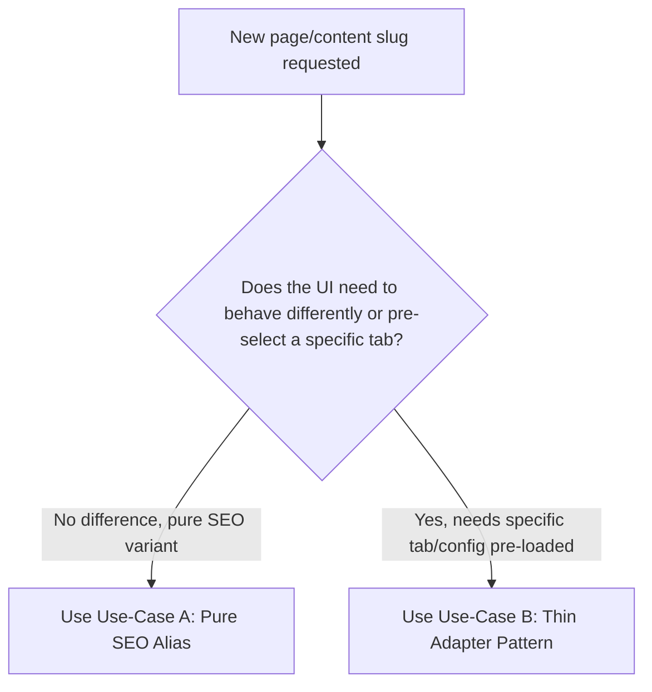

# Architectural Strategy: Sub-Tools of Multi-Feature Tools (Thin Adapter Pattern)

This document outlines the strategy for handling **sub-tools** of a generic multi-feature tool within our Astro-Svelte monorepo. It serves as a decision framework and implementation guide for future tools with similar requirements.

---

## 1. The Core Problem

When we build a complex, multi-feature tool (e.g., a **QR Code Generator** that supports URLs, Wi-Fi, Text, E-mails, etc.), we face two conflicting requirements:
1. **Generic Hub View**: A single page (`/qr-code-generator`) with a tabbed interface, acting as a one-stop hub.
2. **Focused Sub-Tool Pages**: Dedicated SEO-focused pages (e.g., `/wifi-qr-code-generator` or `/text-qr-code-generator`) that load the same widget but must pre-select the relevant tab automatically.

---

## 2. Decision Tree: SEO Alias vs. Sub-Tool

Before writing any code, determine which pattern fits your requirement:



### Use Case A: Pure SEO Alias
* **Definition**: Different page/content URLs that render the **exact same tool** with the **exact same UX** and no initial state difference (e.g., `/systematic-investment-plan-calculator` vs. `/sip-calculator`).
* **Solution**: Use the `widgetSlug` frontmatter property in the alias's markdown file.
  ```yaml
  # In src/content/tools/systematic-investment-plan-calculator/index.md
  widgetSlug: "sip-calculator"
  ```
  The build-time widget mapper (`generateWidgetMap`) detects this and redirects the page to import the shared `features/sip-calculator/Widget.svelte` directly.

### Use Case B: Sub-Tool of a Generic Parent
* **Definition**: Focused pages that render the parent tool but require a **specific initial configuration or pre-selected tab** (e.g., `/wifi-qr-code-generator` rendering the QR code generator pre-configured to the Wi-Fi tab).
* **Solution**: **Thin Adapter Pattern**. Do NOT use `widgetSlug` in the frontmatter. Instead, create a dedicated thin Svelte component.

---

## 3. Thin Adapter Pattern Implementation

For any new generic tool that requires dedicated sub-tools, follow these three steps:

### Step 1: Add a Configuration Prop to the Parent Widget
Modify the parent widget to accept an `initialMode` (or equivalent config prop) with a default value. This ensures the generic hub page behavior is completely unchanged.

```svelte
<!-- src/features/my-generic-tool/Widget.svelte -->
<script lang="ts">
  type Mode = 'default-mode' | 'sub-mode-a' | 'sub-mode-b';

  // 1. Accept initialMode prop with a default fallback
  let { initialMode = 'default-mode' }: { initialMode?: Mode } = $props();

  // 2. Initialize the reactive state using the prop
  // svelte-ignore state_referenced_locally
  let activeTab = $state<Mode>(initialMode);
</script>

<div>
  <!-- Tab selectors & UI -->
</div>
```

### Step 2: Create Thin Adapter Widgets for Sub-Tools
For each sub-tool page, do **not** set `widgetSlug` in the content markdown. Instead, create a small Svelte widget file under `src/features/<sub-tool-slug>/Widget.svelte`. 

Import the parent widget and pass the desired initial configuration:

```svelte
<!-- src/features/sub-mode-a-tool/Widget.svelte -->
<script lang="ts">
  import GenericTool from '../my-generic-tool/Widget.svelte';
</script>

<GenericTool initialMode="sub-mode-a" />
```

### Step 3: Let the Widget Mapper Auto-Generate the Rest
Because the thin adapter widget `src/features/<sub-tool-slug>/Widget.svelte` exists, the automatic `widgetMap()` Astro integration will:
1. Detect the widget under the sub-tool's directory.
2. Generate the code-split wrapper at `src/generated/widgets/<sub-tool-slug>.astro`.
3. Hydrate and load the thin adapter at client runtime, which immediately renders the parent widget pre-configured.

---

## 4. Why We Chose This Pattern (Rejected Alternatives)

During design discussions, we explicitly rejected the following alternatives due to maintainability trade-offs:

* **❌ Frontmatter Config Field (`widgetConfig: "wifi"`)**
  * *Why rejected*: Passing runtime JS configuration/props through markdown frontmatter is fragile, pollutes content schemas, lacks TypeScript type safety, and does not scale well if tools need complex objects instead of simple strings.
* **❌ Route/URL-derived State (reading `window.location`)**
  * *Why rejected*: Coupling the internal Svelte widget logic to page paths or routing is an anti-pattern. If a page URL is changed for SEO purposes later, the Svelte component's internal state logic will break.
* **❌ Deep WidgetSlug String Suffix (`widgetSlug: "qr-code-generator#wifi"`)**
  * *Why rejected*: Combines bundler configuration/code splitting concern with runtime state initialization into a single parsed string field, which is fragile and lacks verification/type safety.
